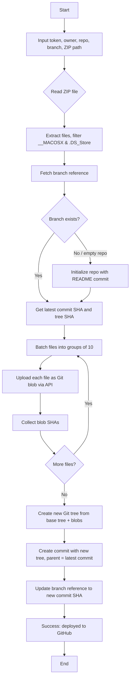

# GitHub ZIP Deployer

[](app.py)
[](app.go)
[](app.cxx)
[](app.erl)
[](app.rb)
[](index.php)
[](app.lua)
[](app.io)
[](app.reb)
[](app.hs)
[](app.fs)

A collection of command-line tools that extract a ZIP archive and push its contents directly to a GitHub repository using the GitHub API. Available in 11 programming languages plus a browser-based version.

## Overview



GitHub ZIP Deployer allows you to upload the contents of a ZIP file to a GitHub repository without cloning or using Git commands. Each language implementation follows the same workflow:

1. Read a ZIP file from disk.
2. Filter out system metadata (__MACOSX, .DS_Store).
3. Interact with the GitHub API to create blobs, build a tree, create a commit, and update a branch reference.
4. Provide real-time colored log output.

All tools are self-contained, require no external servers, and run entirely on your machine.

## Language Versions

| Language | File | Dependencies | Run Command |
|----------|------|--------------|--------------|
| Python | app.py | requests, colorama | `python app.py` |
| Go | app.go | (none, uses stdlib) | `go run app.go` |
| C++ | app.cxx | libcurl, libzip, nlohmann/json | `g++ -o app app.cxx -lcurl -lzip && ./app` |
| Erlang | app.erl | jsx, ibrowse (or httpc) | `escript app.erl` |
| Ruby | app.rb | rubyzip, json | `ruby app.rb` |
| PHP | index.php | zip, curl (extensions) | `php index.php` |
| Lua | app.lua | luasocket, lua-zip, json-lua | `lua app.lua` |
| Io | app.io | (requires Io language with Zip addon) | `io app.io` |
| Rebol | app.reb | (Rebol 2 or 3 with Base64) | `rebol app.reb` |
| Haskell | app.hs | stack with aeson, zip-archive, http-conduit | `stack app.hs` |
| Forth | app.fs | Gforth, curl, jq, unzip | `gforth app.fs` |

Additionally, a browser-based HTML/JavaScript version is available in the original repository (index.html) for users who prefer a graphical interface.

## Prerequisites

- A GitHub account.
- A personal access token with at least the `repo` scope.  
  [Create one here](https://docs.github.com/en/authentication/keeping-your-account-and-data-secure/managing-your-personal-access-tokens).
- The required runtime and libraries for your chosen language (see table above).

## Installation

Clone the repository:

```bash
git clone https://github.com/iciiwhite/zip-deployer.git
cd github-zip-deployer
```

Then follow the language-specific setup.

### Python

```bash
pip install requests colorama
python app.py
```

### Go

```bash
go run app.go
# or build: go build -o deploy app.go
```

### C++

Install dependencies (example for Ubuntu):

```bash
sudo apt install libcurl4-openssl-dev libzip-dev nlohmann-json3-dev
g++ -o app app.cxx -lcurl -lzip
./app
```

### Erlang

Ensure jsx and ibrowse are available (use rebar3 or install via apt install erlang-jsx). Then:

```bash
escript app.erl
```

### Ruby

```bash
gem install rubyzip
ruby app.rb
```

### PHP

```bash
php index.php
```

### Lua

Install LuaRocks and dependencies:

```bash
luarocks install luasocket
luarocks install lua-zip
luarocks install json-lua
lua app.lua
```
### Io

Requires Io language with Zip addon. Install Io from iolanguage.org then:

```bash
io app.io
```

### Rebol

Use Rebol 2 or 3. The script uses to-json and from-json helpers. Run:

```bash
rebol app.reb
```

### Haskell

Uses Stack. Run:

```bash
stack app.hs
```

#s# Forth

Requires Gforth, curl, jq, and unzip. Run:

```bash
gforth app.fs
```

## Usage

All language versions are interactive command-line tools. After starting the script, you will be prompted for:

· Personal Access Token
· Repository owner (username or organization)
· Repository name
· Target branch (default: main)
· Path to the ZIP file

### Example session (Python):

```
$ python app.py

GitHub ZIP Deployer — Tool by Icii White

🔑 Personal Access Token (repo scope): ghp_...
👤 Repository owner (username or org): octocat
📁 Repository name: hello-world
🌿 Branch name (default: main): main
🗂️  Path to ZIP file: ./project.zip

[14:32:15] ➜ Target: octocat/hello-world on branch 'main'
[14:32:15] ➜ ZIP file: ./project.zip
[14:32:15] ➜ Reading ZIP file in memory...
[14:32:16] ➜ Found 42 valid files to process.
[14:32:16] ➜ Fetching branch 'main' details...
[14:32:17] ➜ Uploading files as blobs...
[14:32:18]   -> Uploaded 10 / 42 files...
[14:32:19]   -> Uploaded 20 / 42 files...
...
[14:32:25] ➜ Constructing new Git tree...
[14:32:26] ➜ Creating commit...
[14:32:27] ➜ Updating branch reference to new commit...
[14:32:28] ✓ Successfully deployed 42 files to octocat/hello-world on branch 'main'! 
[14:32:28] ➜ https://github.com/octocat/hello-world/tree/main
```

All implementations produce similar colored output with timestamps.

## How It Works

1. **Authentication** – The tool uses the provided personal access token for all GitHub API requests.
  
2. **ZIP Processing** – The ZIP file is read and each file is extracted. Files inside __MACOSX/ or named .DS_Store are ignored.

3. **Branch Handling** – The tool attempts to fetch the current commit SHA of the target branch. If the branch does not exist or the repository is empty, it creates an initial commit with a README.md.

4. **Blob Upload** – Each file is uploaded as a Git blob using the POST /repos/{owner}/{repo}/git/blobs endpoint. Uploads are performed in parallel batches (default batch size = 10).

5. **Tree Creation** – A new Git tree is created that references all uploaded blobs, using the existing tree as the base.

6. **Commit Creation** – A commit is created with the new tree and the parent commit from the branch.

7. **Branch Update** – The branch reference is updated to point to the new commit.

All API calls are authenticated and respect GitHub's rate limits.

## Troubleshooting

· **Authentication failed** – Verify that your token has the repo scope and is valid. Ensure you are using the correct owner/repo names.

· **Branch not found / empty repository** – The tool automatically initializes empty repositories. If you see errors, you may need to manually create an initial commit (e.g., via GitHub web interface) before using the tool.

· **Rate limiting** – Authenticated requests have a limit of 5,000 per hour. If you exceed this, wait an hour or use a different token.

· **Large ZIP files** – The tools load the entire ZIP into memory. For very large archives (e.g., >500MB), you may encounter memory issues. Consider splitting the archive or using a different approach.

· **Missing dependencies** – Refer to the Installation section for each language. Most errors are due to missing libraries or incorrect runtime versions.

## Contributing

Contributions are **welcome**. Please open an issue or submit a pull request. Areas for improvement:

· **Add more language versions** (Rust, Node.js, C#, etc.)
· **Improve error handling** and **retry logic.**
· **Support incremental updates** (only changed files).
· Add a configuration file option to avoid interactive prompts.

## License

> This project is licensed under the MIT License. See the [license](LICENSE) file for details.

> Disclaimer

This software is provided "**as is**", without warranty of any kind. Use at your own risk. Always ensure you have backups of your repository before performing bulk operations.
